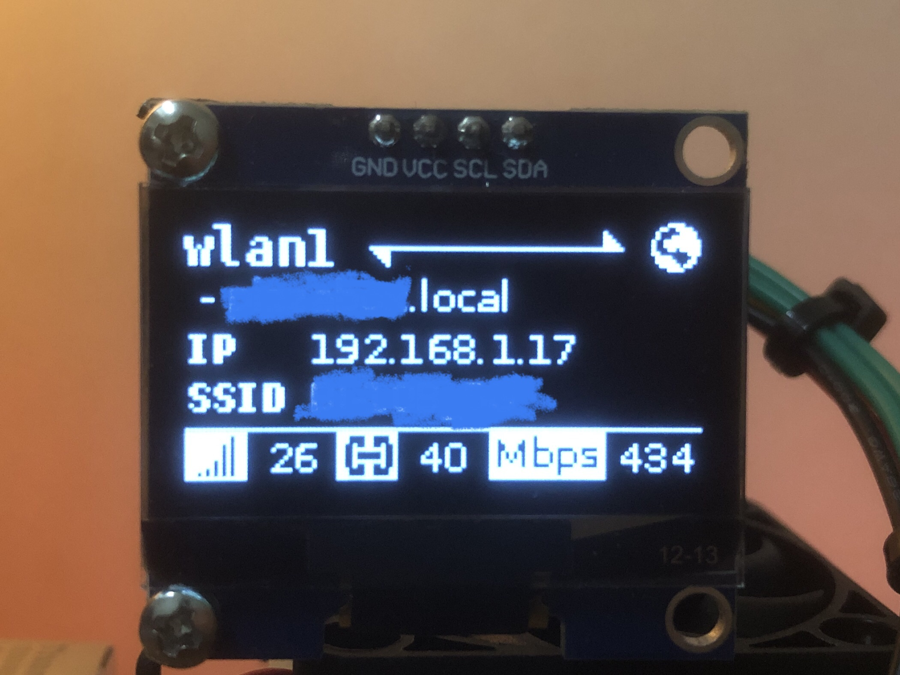
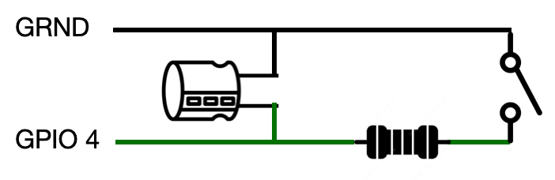
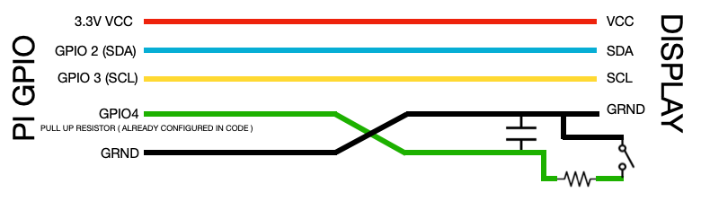

# OLED Stats Display for Raspberry Pi

A lightweight, customizable stats display built in Python using `luma.oled` and `libgpiod v2`. Designed for Raspberry Pi with a 1.3" OLED screen, it shows real-time hardware and network stats — with physical button-based navigation.

---

## ✨ Features

- 📊 System stats: CPU, RAM, RP1 chip, PMIC, NVMe
- 🌐 Network info: IP address, mDNS, and more
- 🖥️ Multiple screens: Home (main and default), Options (hardware selection), Network
- 🔘 Button navigation (click / long press / double click)
- 💤 Idle timeout with screen saver (prevent screen burning)
- 👀 Cool looking screensaver animation [Robo Eyes]. Shoutout to [sofianhw/RoboEyes](https://github.com/sofianhw/RoboEyes) for the screen saver code used and adapted here!
- 🛠️ Configurable via `config.ini`
- 🔄 Systemd service for auto-start
- 👨‍💻 Developer-friendly structure with virtualenv support

---

## Preview



---

## 📦 Dependencies

- Python 3

- [`libgpiod v2`](https://git.kernel.org/pub/scm/libs/libgpiod/libgpiod.git)  
> ⚠️ This project **requires `libgpiod v2`**, regardless of Raspberry Pi model.
>    
> It's used for precise button event handling (including timeouts for double-click support).
>  
> DONT PANIC!! ⚠️ You can eliminate / skip  this by either changing the code to libgpiod V1 or if you chose some other way to toggle the screen. Trust me, its very simple -> [How to change screen toggle function](#How-to-change-screen-toggle)


## Hardware Requirements
BASIC
- I2C display (SH1106 or another 1.3-inch OLED display) — please check luma.oled for supported I2C displays 
- 26 AWG wires, Dupont housing, and pins  

BUTTON CLICK TOGGLE CIRCUIT 
- Capacitor (0.1µF)  
- Resistor (10kΩ) 
- Tactile Button 


## RC Circuit For Button toggle


-You can get by with a simple button circuit, but the signals won’t be clean due to button bounce issues.   
-To know about the button bouncing and rc circuit check on https://youtu.be/tI6B6BRKU5k?si=kr0qGCNcuo0YyN5I


## Optimal wiring diagram


This diagram represents the full wiring setup. For Pi 5, you can use a 5-pin Dupont housing for a cleaner, more minimal setup.


# GETTING STARTED

### 🔍 libgpiod V2

CHECK VERSION
```bash
gpiodetect --version
```

UPGRADE LIBGPIOD V2
- visit := https://libgpiod.readthedocs.io/en/latest/
- make sure to select version 2+  (libgpiod)
- install python binding from the package (gpiod)

## For End Users ( System service setup )

> ⚠️ Only for stock setup using [button circuit](#Optimal-wiring-diagram) ( DEFAULT GPIO 4, can be altered in config.ini later in installation )  
> If you dont prefer button circuit or want to preview without button circuit then follow [development](#For-Development-or-Preview-without-button-circuit) and [make your own screen toggle](#How-to-change-screen-toggle) 
```bash
# 1. 📥 Install the Software
sudo git clone https://github.com/xxDURGEXxx/Stats-Oled-Raspberry-Pi-5.git /usr/local/bin/stats_oled  
cd /usr/local/bin/stats_oled  
sudo python3 -m venv environment --system-site-packages  
sudo environment/bin/pip install -r requirements.txt

# 2. ⚙️ Configure
sudo mkdir -p /etc/stats_oled
sudo cp config/config.ini.example /etc/stats_oled/config.ini
sudo nano /etc/stats_oled/config.ini  (if there are any changes you want to make)

# 3. 🔁 Create systemd Service
sudo cp systemd/stats-oled.service /etc/systemd/system/stats-oled.service
#Make sure this matches your Python path (default):
#   -ExecStart=/usr/local/bin/stats_oled/environment/bin/python /usr/local/bin/stats_oled/main.py

# 4.  Enable run on boot and start
sudo systemctl daemon-reload
sudo systemctl enable stats-oled
sudo systemctl start stats-oled
```

## For Development or Preview without button circuit

### Installation
```bash
git clone https://github.com/xxDURGEXxx/Stats-Oled-Raspberry-Pi-5.git

cd Stats-Oled-Raspberry-Pi-5

cp config/config.ini.example config/config.ini

sudo python3 -m venv environment --system-site-packages

source environment/bin/activate

pip install -r requirements.txt

deactivate
```
---
### Terminal Navigation ( For Preview Purposes Only — Not Recommended for systemd )

To simulate button inputs using your keyboard (for preview/testing only), enable the terminal input listener.

🛠️ **To enable:**
Uncomment the following sections in `main.py`:

```python
# Listener function
def user_input_listener() :
    print('\n')
    print('OPTIONS AVAILABLE :  next  back  select')
    while True:
        act=input("-> ")

        if act == 'next' : toggle_user_event(ACTION_NEXT)
        elif act == 'back' : toggle_user_event(ACTION_BACK)
        elif act == 'select' : toggle_user_event(ACTION_SELECT)
        else : print("Invalid Input")

# Creating thread
user_input_listener_thread = threading.Thread(target=user_input_listener, daemon=True)

# Starting the thread
user_input_listener_thread.start() 
```

This will allow you to type :-  
- next    → go to next screen  
- back    → go to previous screen  
- select  → select/enter

>⚠️ Make sure to comment out the above sections if your done with preview because the thread might run unwantedly during systemd service.
---

### Execution for testing
```bash
#enter into environment
source environment/bin/activate

#execute and test
python3 main.py
# Ctrl + C to exit

# to exit environment
deactivate
```
---
### To make your own custom user screen toggle function [go to section](#How-to-change-screen-toggle)  
>⚠️ If you're going with a custom function, make sure you [disable the default listener](#disable-the-default-handler)

---
### Seting up for system service setup

```bash
# ---- Deployment After Modifications ----

# 1. 📥 Move the folder to apropriate place
sudo cp -r [path to the source folder] /usr/local/bin/stats_oled  
cd /usr/local/bin/stats_oled  

# Remove the environment folder if it exists from development
sudo rm -r environment

sudo python3 -m venv environment --system-site-packages  
sudo environment/bin/pip install -r requirements.txt

# 2. ⚙️ Configure
sudo mkdir -p /etc/stats_oled

# if you have made change to config file previously
sudo cp config/config.ini /etc/stats_oled/config.ini

# 3. 🔁 Create systemd Service
sudo cp systemd/stats-oled.service /etc/systemd/system/stats-oled.service
#Make sure this matches your Python path (default):
#   -ExecStart=/usr/local/bin/stats_oled/environment/bin/python /usr/local/bin/stats_oled/main.py

# 4.  Enable run on boot and start
sudo systemctl daemon-reload
sudo systemctl enable stats-oled
sudo systemctl start stats-oled
```


## Uninstall
```bash
sudo systemctl stop stats-oled
sudo systemctl disable stats-oled
sudo rm /etc/systemd/system/stats-oled.service
sudo systemctl daemon-reload

sudo rm -r /etc/stats_oled
sudo rm -r /usr/local/bin/stats_oled
```

## How to change screen toggle

You can replace the default button-based toggle logic with your own input system — such as keyboard input, web triggers, or GPIO alternatives.

### 🧩 Where to Modify

In `main.py`, find the following:

- The `button_listener()` function  
- The thread that starts it (e.g., `Thread(target=button_listener, ...)`)

### 🔄 Steps to Replace

1. **Disable the default handler**  
   Comment out or remove the following:
   ```python
   def button_listener():
       ...
    button_listener_thread = threading.Thread(target=button_listener, daemon=True)
    button_listener_thread.start()
    ```
2. Write your own input function  
   Create a custom function like:
   ```python
   def custom_toggle():
    # Example input logic here
    toggle_user_event(ACTION_NEXT)
   ```

3. Start the new input handler
    ```python 
    customthread=Thread(target=custom_toggle, daemon=True)
    customthread.start()
    ```

Supported Navigation Constants
Use toggle_user_event() with any of the following:
- ACTION_NEXT → Next screen or option
- ACTION_SELECT → Enter/select   
Additionally, when viewing a stats screen (e.g., CPU), pressing ACTION_SELECT again will act as a shortcut to exit directly back to the selection menu — no need for multiple double-clicks.
- ACTION_BACK → Go back


## 📜 License

MIT License — see `LICENSE` file for details.

## 🤝 Contributions

Issues and PRs are welcome! Help improve the project or share your mods.